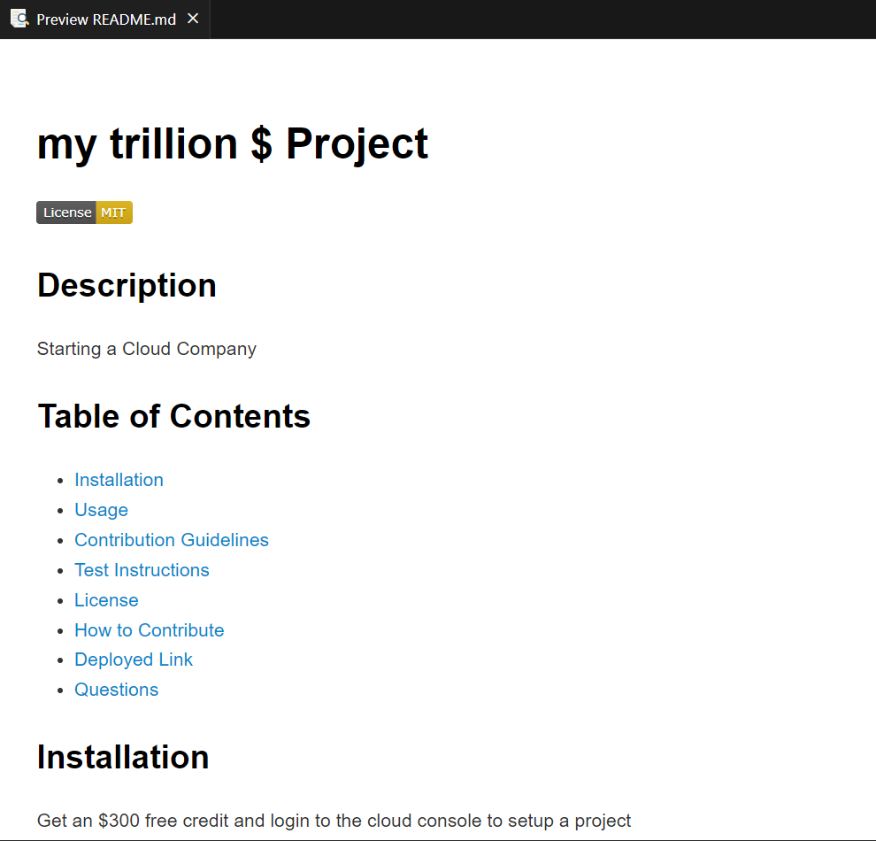

## Professional README Generator

## Objective:

When creating an open source project on GitHub, it’s important to have a high-quality README for the app. This should include what the app is for, how to use the app, how to install it, how to report issues, and how to make contributions—this last part increases the likelihood that other developers will contribute to the success of the project.

You can quickly and easily create a README file by using a command-line application to generate one. This allows the project creator to devote more time to working on the project.

## User Story:

AS A developer
I WANT a README generator
SO THAT I can quickly create a professional README for a new project

## Summary of the Code:

The code provides several functions to generate a README.md file based on user input:

1. `renderLicenseBadge(license)`: This function returns a license badge markdown based on the license provided. It uses a `switch` statement to determine the appropriate badge for the given license.

2. `renderLicenseLink(license)`: This function returns the link to the license text based on the license provided. It uses a `switch` statement to determine the appropriate link for the given license.

3. `renderLicenseSection(license)`: This function returns the license section content for the README based on the license provided. It uses a `switch` statement to determine the appropriate license section for the given license.

4. `generateMarkdown(data)`: This function generates the Markdown content for the README based on the user's input. It takes the user's data as input and uses template literals to format the content.

The `generateMarkdown` function includes the title, license badge, description, table of contents, installation, usage, contribution guidelines, test instructions, license section, credits, badges, features, how to contribute, deployed link, questions section, and contact information.

The code exports the `generateMarkdown` function using `module.exports`, allowing it to be used in other modules.

To use this code, you need to call the `generateMarkdown` function, passing the user's input data to it, and then write the generated content to the README.md file.

## Tasks Completed: 

1. Created the GIT repository named READMEGen2.0
2. Installed inquirer 8.2.4 Package 
3. Tested the functionality by running `node index.js` to generate README.md 
4. Verified the Acceptance Criteria

GIVEN a command-line application that accepts user input
WHEN I am prompted for information about my application repository
THEN a high-quality, professional README.md is generated with the title of my project and sections entitled Description, Table of Contents, Installation, Usage, License, Contributing, Tests, and Questions
WHEN I enter my project title
THEN this is displayed as the title of the README
WHEN I enter a description, installation instructions, usage information, contribution guidelines, and test instructions
THEN this information is added to the sections of the README entitled Description, Installation, Usage, Contributing, and Tests
WHEN I choose a license for my application from a list of options
THEN a badge for that license is added near the top of the README and a notice is added to the section of the README entitled License that explains which license the application is covered under
WHEN I enter my GitHub username
THEN this is added to the section of the README entitled Questions, with a link to my GitHub profile
WHEN I enter my email address
THEN this is added to the section of the README entitled Questions, with instructions on how to reach me with additional questions
WHEN I click on the links in the Table of Contents
THEN I am taken to the corresponding section of the README

5. Pushed the code the repository READMEGen2.0

## Links:

URL to the GitHub repository: https://github.com/arundvp/READMEGen2.0

Walkthrough video demonstrating the functionality of the application: https://drive.google.com/file/d/1_XWElJzFMN1gPeo1WoTxDZExQAHNfFSg/view

## Sample Screen Shot: 

